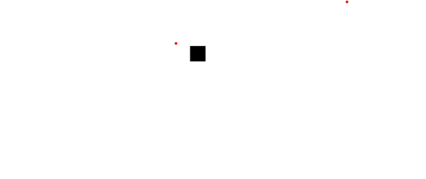
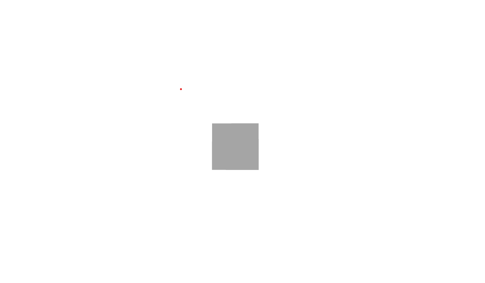

# Using Three Js in React / Next js. OR using 3D in react and next with ts.

- Three js and web gl are by far the simplest and most common libraries used to add 3d to the web but they are not supportted by react out of the box.So we use a library called _React three fiber_ that is built on top of three js .

## Prequisities

- typescript or javascript.
- React or next js basics.
  - Have an understanding of how to create components,use hooks like useRef,useState,useEffect.
- Three js basics.
  - Have an understanding of what a canvas,camera,renderer, scene,orbit-controls,lights are.
- Any React animation library like framer-motion or react-spring.

## Steps

- Spin up a new next js or react app.

### Packages To Install

- Install required packages.
  `yarn add three react-three-fiber @react-three/drei react-spring`
  - _Three_ - Is a the library used to render 3d in the browser.
  - _React Three Fibre_ -Is the Library the contains or three js components for react.
  - _drei_ - Is a library that provides a quick way to add effects like softshadows,wobbling,orbit-controls e.t.c.
  - _react-spring_ - animation library for react .we use this because framer doesnt allow animation of meshs or groups related to threeJS.
- if your using typescript.
  `yarn add -D @types/three`

### Definitions to note

1. **Canvas**
   - This is basically your portal into threeJS. it renders threeJS elements,not DOM elements(_we cant write any html in the canvas_).
   - So normally in normal threeJS we have to setup a camera, canvas and a scene but in react three fibre all that is set up with in the canvas.
   - Defaults that the canvas component sets up:
     - transluscent WebGL renderer
     - Perspective Camera
     - Orthographic Camera
     - A Scene
     - Wrapping container with a resize observer.
2. **Lights**
   - these are lights used in the scene.
     - _Ambient Light_
       - This light globally illuminates all objects in the scene equally.This light cannot be used to cast shadows as it does not have a direction.
     - _Directional Light_
       - A light that gets emitted in a specific direction.This light will behave as though it infinitely fat away and the rays produced from it are all parallel.The common use case for this is ti simulate daylight.This one casts shadows
     - _Point light_
       - A light that gets emitted from a single point in all directions.A common use case fir this is to replicate the light emitted from a bare lightbulb. these dont provide shadows.
3. **Orbit Controls**
   - This helps us move the canvas around from different perspectives.
4. **Mesh**
   - Class repressenting triangular polygon mesh based objects.
5. **BufferGeometry**
   - An efficient representation of the mesh ,line,or point geometry.Includes vertex positions,face indices,normals,colors,UVs,and custom attributes within buffers,reducing the cost of passing all this data to the GPU.
6. **Material**
   - Materials describe the appearance of objects.They are defined in a (mostly) renderer-independent way,so you donot have to rewrite materials if you decide to use a different renderer.

### Start

- Create a canvas where we shall place all our threeJS elements.

```ts
import { NextPage } from "next";
import { Canvas } from "react-three-fiber";

type Props = {};

const learn: NextPage = (props: Props) => {
  return (
    <>
      <Canvas></Canvas>
    </>
  );
};

export default learn;
```

- We are going to create a cube inside the canvas.So we start by adding a mesh , the geometry which defines the specific shape and the material which defines what it will look like.
- When defining these elements a required attibute is _attach_ which lets us know if its represented of the geometry or the material
- _args_ represents the general arguments like the height, width and depth these are passed in an array

```tsx
<Canvas style={{ width: `100vw`, height: `100vh` }}>
  {/* Define Mesh */}
  <mesh>
    {/* Define Geometry */}
    <boxBufferGeometry attach="geometry" args={[1, 1, 1]} />
    {/* Define Material */}
    <meshStandardMaterial attach="material" />
  </mesh>
</Canvas>
```

- Now you should see a small box on the screen
  

- or you can use the box component in drei to display a box

```tsx
import { Box } from "@react-three/drei";

type Props = {};
const learn: NextPage = (props: Props) => {
  return (
    <>
      <Canvas style={{ width: `100vw`, height: `100vh` }} >
     <Box />
      </Canvas>
    </Canvas>
  );
};

export default learn;
```

- To give it color we add the _meshStandardMaterial_ as a child.The default color is black but you can pass a custom color to it via the color property.

```tsx
<Box>
  <meshStandardMaterial attach="material" />
</Box>
```

- In this tutorial we shall stick to the mesh because we want to learn thrreeJS fubdamentals in React.
- There various shapes like circle (_it takes two arguments which are the size and amount of angles _)
  **note** that if you put 1 as the angle it will give you a triangle.
  `<circularBufferGeometry attach="geometry" args={[2,200]} /> `
- So now we need rotate the box.Inorder to do that we use a hook from React Three fibre know as `useFrame` that is called every time a frame is rendered we shall also need `useRef` from react which will help us keep the reference to our mesh.But inorder to do that we need to extrat our mest to its own component.

  ```tsx
  import { NextPage } from "next";
  import React, { useRef } from "react";
  import { Canvas, useFrame } from "react-three-fiber";
  import { Mesh } from "three";

  type Props = {};

  const learn: NextPage = (props: Props) => {
    return (
      <>
        <Canvas
          className="h-[100vh] absolute w-[100vw]"
          style={{ width: `100vw`, height: `100vh` }}
        >
          <Cube />
        </Canvas>
      </>
    );
  };

  export default learn;

  const Cube = () => {
    const mesh = useRef<Mesh>(null);
    useFrame(
      () => (mesh.current!.rotation.x = mesh.current!.rotation.y += 0.01)
    );
    return (
      <mesh ref={mesh}>
        <boxBufferGeometry attach="geometry" args={[1, 1, 1]} />
        <meshStandardMaterial attach="material" />
      </mesh>
    );
  };
  ```

- So next we have to add light because there cant be color without light.So we add an ambient light its first property is intensity which is the light intensity.
  <!-- TODO: Convert to gif -->
  

```tsx
<Canvas style={{ width: `100vw`, height: `100vh` }}>
  <ambientLight intensity={0.3} />
  <Cube />
</Canvas>
```

- notice that the box becomes slightly dull.
  
